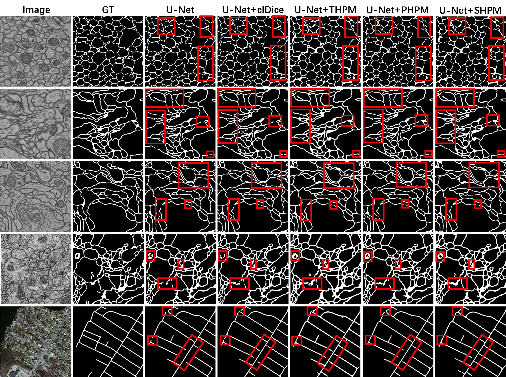

## Topology-Preserving Hard Pixel Mining for Tubular Structure Segmentation
This is the official pytorch implementation of Paper "Topology-Preserving Hard Pixel Mining for Tubular Structure Segmentation", BMVC 2023.



### Prerequisites
Install Requirements: 
```
conda install --yes --file requirements.txt
```
Install topohpm:
```
python setup.py install
```
### Train
Given the package `topohpm` installed, we can train the network through following command:
```
train3dunet --config <CONFIG>
```
To train the network, we need to specify a config file. We have provide several config files for different datasets and different losses in `resource` folder. In our experiments, the method is evaluated through 5-fold cross validation. We use the code `topohpm/scripts/random_split_k_fold.py` to randomly split the dataset into k fold.
```
python random_split_k_fold.py -r <raw_dir> -l <label_dir> -o <output_dir> -k <kfold=5>
```
`train.sh` is the script for k-fold batch training:
```
nohup ./train.sh &
```
### Prediction
Given the package `topohpm` installed, we can run the prediction via:
```
predict3dunet --config <CONFIG>
```
Similar to the training process, we need to specify a config file for prediction. `predict.sh` is the script for k-fold batch prediction, which saves all the predictions into `generated_files/predictions`:
```
nohup ./predict.sh &
```
### Evaluation
We compute *Dice coefficient* and *MeanIoU* to evaluate the volumetric accuracy, *Variation of Information (VOI)* and *Adapted Rand Error (ARE)* for clustering-based metrics, *Betti-0* and *Betti-1* error as topology measurements, respectively. Evaluation on 2D image and 3D image can be done through `topohpm/scripts/evaluate.py` and `topohpm/scripts/evaluate3d.py`, respectively.
### BibTeX
```
```
### Acknowledgements
The code structure is mainly inherited from [pytorch-3dunet](https://github.com/wolny/pytorch-3dunet).